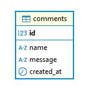
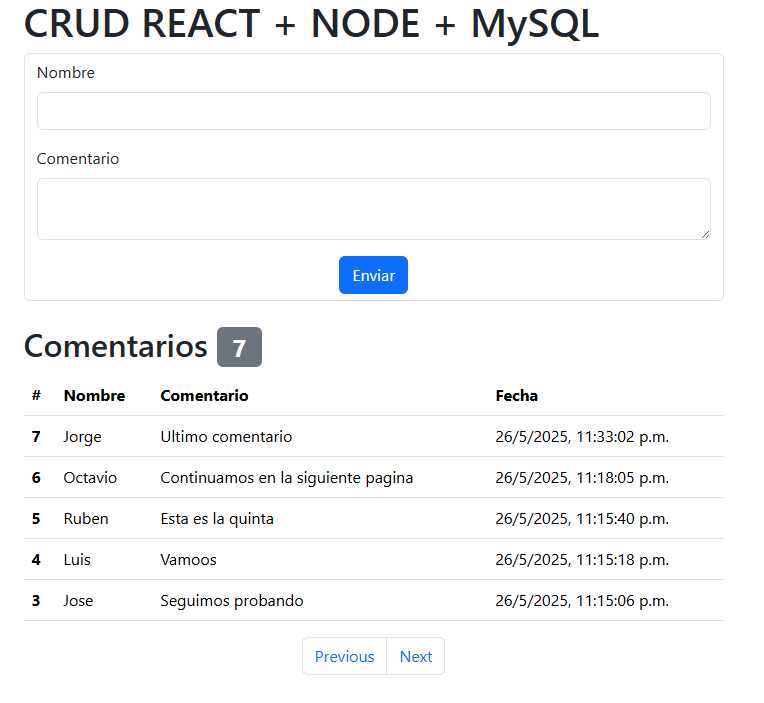
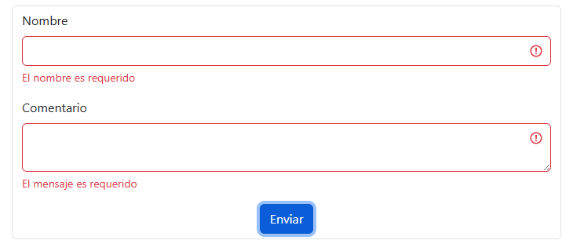

# CrudRNM
## Versiones utilizadas
* Node 23.6.0
* MySQL 8.0.42

## Base de Datos
La base cuenta con una unica tabla, la cual se compone de 4 campos, siendo el campo id la llave primaria e identificador unico de cada registro.

## Backend 
El backend esta elabora de Node.js, por simplicidad el proyecto se divide en 3 archivos.

### config.js
En este archivo se encuentra el acceso a las variables de entorno las cuales permiten la conexión a la base de datos y define el puerto en que se ejecuta el backend.

### dbConnection.js
Es la conexión a la base de datos, dicha conexión se maneja por medio de un pool el cual permite un máximo de 10 conexiones a la vez.

### index.js
Es el archivo principal del proyecto y donde se encuentra el enrutador para los dos enpoints requeridos. En un proyecto más grande lo ideal es segmentar esta parte utilizando controladores para tener una mejor organización, pero en este caso no se ve necesario.

---
Para ejecutar esta parte es necesario la instalación de los módulos. El proyecto también cuenta con la librería de desarrollo Nodemon, en caso de instalarla se puede usar el comando `npm run dev` para ejecutar el backend. Así mismo, no olvide crear el archivo **.env** similar al que se encuentra de ejemplo, configurandolo para su uso en su propio entorno local.

## Frontend
Para el frontend se utilizaron 3 archivos para el manejo de la vista siendo el archivo principal **App.jsx** el layout de la vista completa y fragmentando la página los componentes **Formulario.jsx** y **Tabla.jsx**, para la creación el ingreso y vista de los comentarios.

Como agregados la vista cuenta con un conteo de los comentarios y páginación de los mismos.

En caso que el usuario no complete el formulario, este también cuenta con alertas visuales que indican lo que debe realizar.
